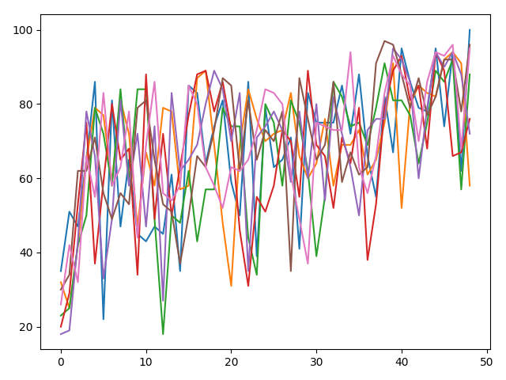
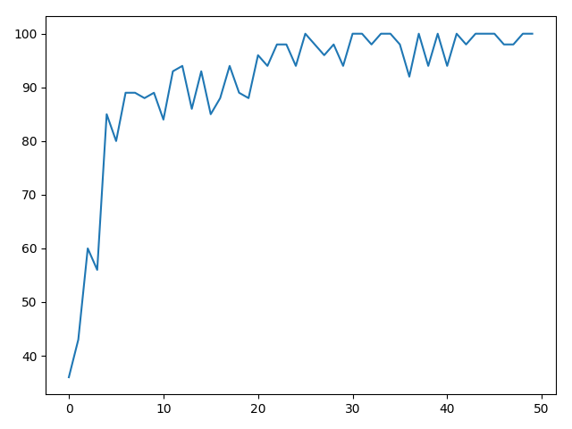
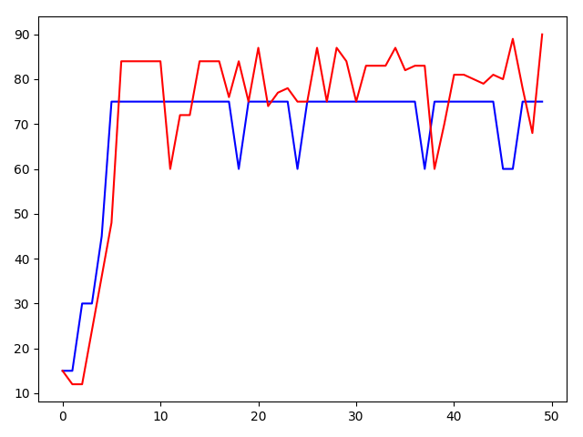
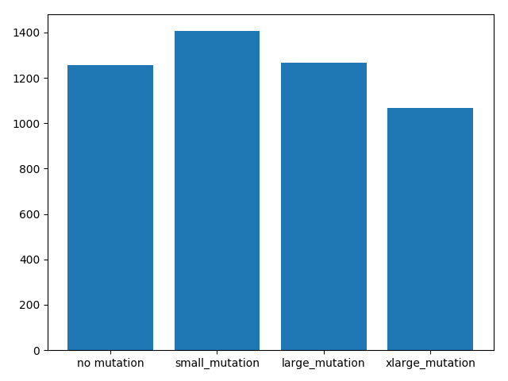

# Genetic Problem Solving

This is a small project of mine solve a simple problem using a genetic algorithm.
I took a functional approach as the amount of objects I may have to create may hinder
performance especially when using python.

##Bag Packing Problem

This is a simple implementation of a genetic algorithm, to the bin packing optimisation problem.
This means that genetic theory is applied to the problem, which can be done by selection the most successful in the population, 
using some function by which to breed them and then applying random mutations to avoid a local maximum. 

To explain how it works first let me describe the model I used:

bricks: they are items with both a value and a weight

bag: hold bricks

generation: a collection of bags

The goal (fitness function) is to have the bag with the highest value.

##Description of the algorithm

I first generate a new generation which is essentially bags with random bricks in chosen from a pool.
Then I choose the top 50% of that generation and randomly pair them together
I breed these pairs to create 4 children from each pair which get a random assortment of bricks from their parents
Children then have a variable chance of being mutated which means they gain or lose a brick. ( the brick they gain isn't necessarily from their parents)

To see whether the algorithm gets the optimal answer, we can use a non genetic algorithm to calculate it which goes as follows:

Find the brick with the best value/weight value
put as many of these in the bag until you can fit no more
then put the next item in the bag until you can fit no more of them
continue until the bag is full or you have tried to add all the bricks

##Representing Data

This is what it looks like tracking the progress of the value of each of the bags in a generation.

Its quite messy so to show the progress I only display the bag with the max value, like this.

##Value of mutation

This graph shows two max value lines.
The blue line showing a generation with no mutation,
and the red line showing a generation with mutation.

You can clearly see that the blue line reaches a local minimum.
As its bricks cannot randomly mutate to produce a better result.
The red line while more sporadic does eventually reach a higher maximum.

Local minimums can be effected by the generation size as the smaller the generation the smaller the genetic diversity.

If we run 50 generations 5000 times and see who produces the highest value in the generation we get this.

We see that a small amount of mutation (1 in 8 chance of mutation that a mutation happens per child) often produces the
highest value.

When there is a large mutation (1 in 4) we can see that it has no effect as it gets rid of the good genes as well as the
bad ones.

Finally, when we have a half chance of a mutation in a child we can see that it has a negative effect in the values it
produces.

